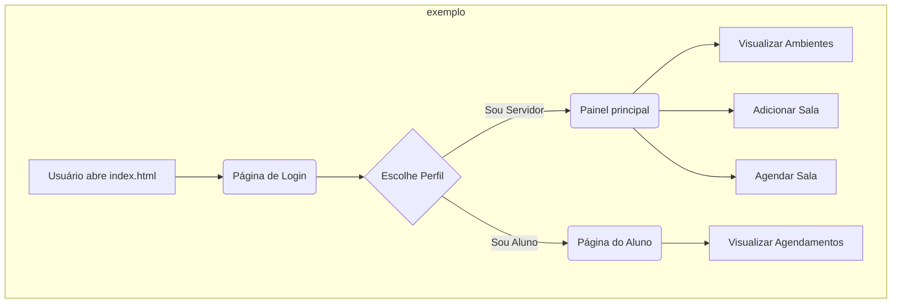

# Sistema de Gerenciamento de Ambientes Acadêmicos

Sistema web front-end para agendamento e gerenciamento de salas e ambientes universitários.


## Sumário

- [Pré-requisitos](#pré-requisitos)  
- [Instalação](#instalação)  
- [Instruções de Uso](#instruções-de-uso)  
- [Fluxo do Sistema](#fluxo-do-sistema)  
- [Contato](#contato)  
- [Bibliografia](#bibliografia)  

## Pré-requisitos

O projeto é uma aplicação front-end que utiliza apenas HTML, CSS e JavaScript, não exigindo um ambiente de back-end. A configuração mínima para visualização é um navegador de internet moderno.

| Configuração       | Valor Mínimo                               |
|-------------------|--------------------------------------------|
| Sistema operacional | Windows, macOS ou Linux                    |
| Navegador          | Google Chrome, Firefox, Safari ou Edge     |
| Memória RAM        | 2GB                                        |
| Necessita rede?    | Sim (para carregar fontes e bibliotecas externas) |

## Instalação

1.  Como o projeto não possui dependências de pacotes, não há um processo de instalação complexo. Basta clonar o repositório para sua máquina local:

    ```bash
    git clone https://github.com/ericdalaporta/sistema-gerenciamento-salas.git
    ```

2. **Navegue até a pasta do projeto:**
    ```bash
    cd sistema-gerenciamento-salas
    ```

3.  **Abra o projeto:**
    * Não há dependências para instalar. Abra o arquivo `index.html` diretamente no seu navegador.
    * Para uma melhor experiência de desenvolvimento, recomenda-se usar a extensão **Live Server** no Visual Studio Code.

## Instruções de Uso

Para executar e testar a aplicação, siga os passos:

1.  Abra o arquivo `index.html` no seu navegador. A tela de login será exibida.

2.  Simule o acesso com um dos perfis disponíveis:
    * **Sou Servidor:** Representa o perfil de administrador. Ao clicar em "Entrar", você será levado ao painel principal (`principal.html`) com acesso a todas as funcionalidades de gerenciamento, assim como ver os próprios agendamentos.
    * **Sou Aluno:** Representa o perfil de usuário final. Ao clicar em "Entrar", você será levado a uma página (`aluno.html`) que exibe os agendamentos de ambientes acadêmicos realizados por seus professores, assim como a disciplina, horário e nome do professor.

3.  **No painel do Servidor, você pode:**
    * Visualizar todos os ambientes cadastrados.
    * Utilizar os filtros para buscar salas por tipo ou data.
    * Clicar em **"Adicionar Sala"** para cadastrar um novo ambiente.
    * Clicar em **"Agendar"** em um dos cards para marcar um horário, definindo período, dias da semana e disciplina.

## Fluxo do Sistema



## Contato

O repositório foi originalmente desenvolvido por Eric Dala Porta, Email para contato: ericdasilvadalaporta@gmail.com

## Bibliografia

A documentação das principais ferramentas e bibliotecas utilizadas no projeto pode ser encontrada nos links abaixo:

- [Documentação Bootstrap 5.3](https://getbootstrap.com/docs/5.3/getting-started/introduction/)
- [Documentação Bootstrap Icons](https://icons.getbootstrap.com/) 
- [Documentação Flatpickr (Calendário)](https://flatpickr.js.org/)
- [Google Fonts (Inter)](https://fonts.google.com/specimen/Inter)
